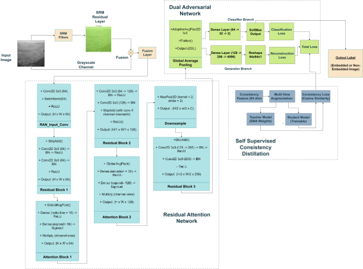
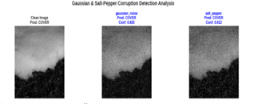
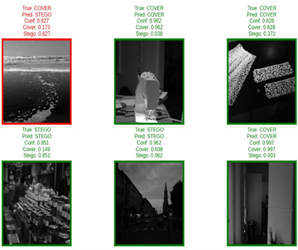

# NoRANet: Noise-Resilient Adversarial Steganalysis Network

NoRANet is a robust and generalizable deep learning framework for **image steganalysis**, designed to reliably detect hidden information under noisy, distorted, and unseen embedding conditions. 
The framework combines residual-based feature extraction, attention mechanisms, adversarial learning, and self-supervised consistency distillation to reduce dependence on large labeled datasets while improving robustness.

---

## Architecture Overview

The proposed framework consists of three main components:

### 1. Residual Attention Network (RAN)
- Extracts pixel-level residual features sensitive to steganographic embedding
- Applies attention mechanisms to emphasize informative residual regions
- Suppresses irrelevant image content

### 2. Dual Adversarial Network (DAN)
- Two-branch architecture:
  - **Classification branch**: predicts cover vs stego
  - **Reconstruction branch**: reconstructs plausible cover images from stego inputs
- Enforces feature consistency using adversarial and reverse-consistency losses
- Improves generalization to unseen embedding methods

### 3. Self-Supervised Consistency Distillation (SSCD)
- Encourages consistent predictions between clean and perturbed versions of the same image
- Improves robustness to noise and distortion
- Reduces reliance on labeled data

---

## Dataset

The framework is evaluated using the **BOSSBase** dataset:
- Standard benchmark dataset for image steganalysis
- Contains grayscale images commonly used in stego detection research

The Steganographic Algorithm used to Train and Test our model is **S-UNIWARD at 0.4 bpp**

---

## Training Pipeline

1. Input image
2. Residual feature extraction
3. Attention-guided residual fusion
4. Dual adversarial learning (classification + reconstruction)
5. Self-supervised consistency distillation
6. Final stego vs cover prediction

Loss functions used:
- Binary classification loss
- Adversarial reconstruction loss
- Consistency distillation loss

---

## Results

Experiments on the BOSSBase dataset demonstrate the following performance:

| Metric        | Value  |
|--------------|--------|
| Test Accuracy | 77.90% |
| F1-Score     | 78.56% |

---

## Outputs and Visualizations

- Stego vs cover predictions
  
  
- Confidence scores under varying noise levels
  

---

